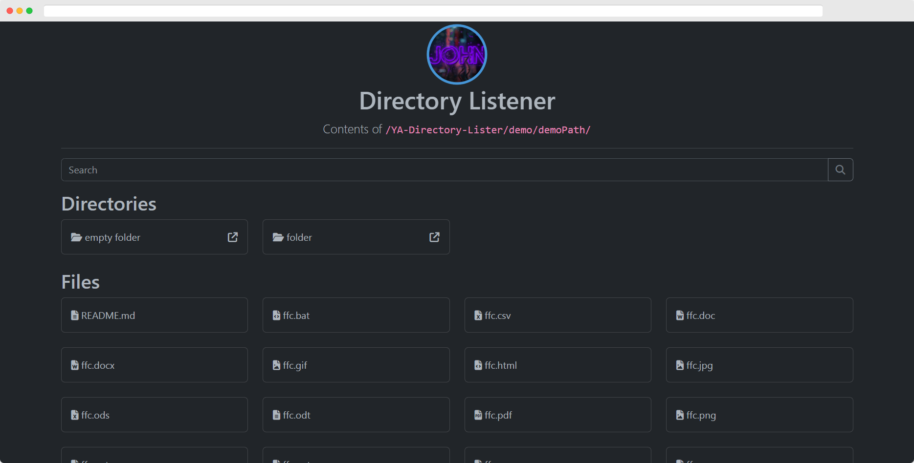
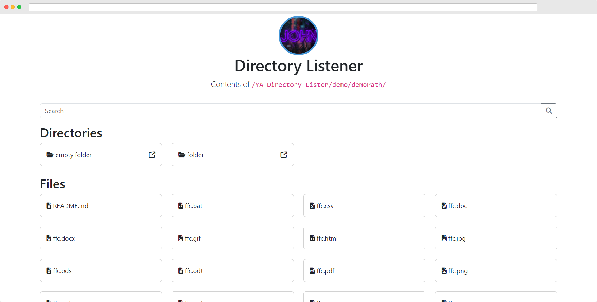
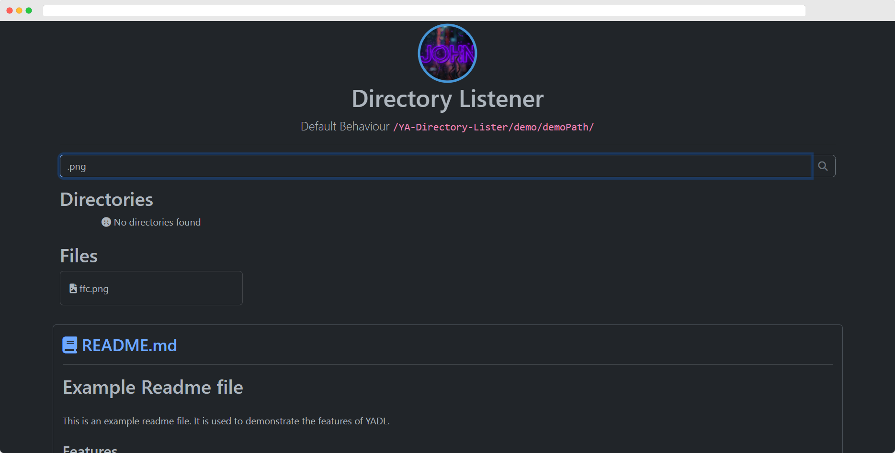
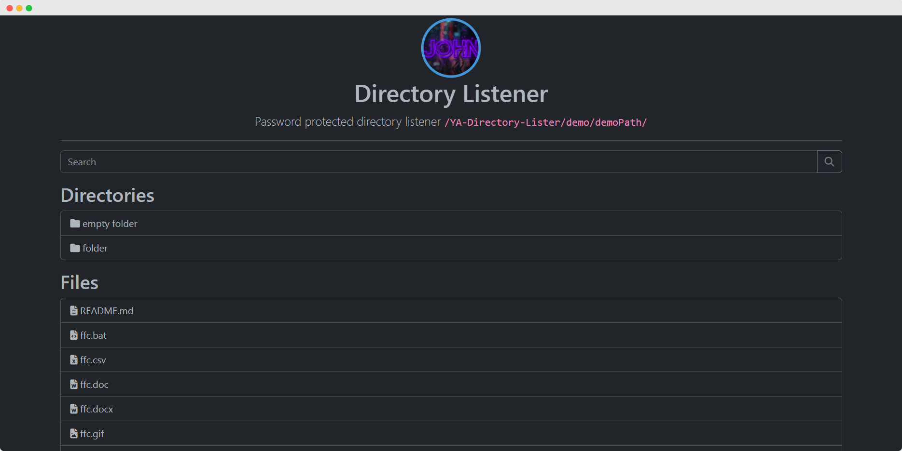
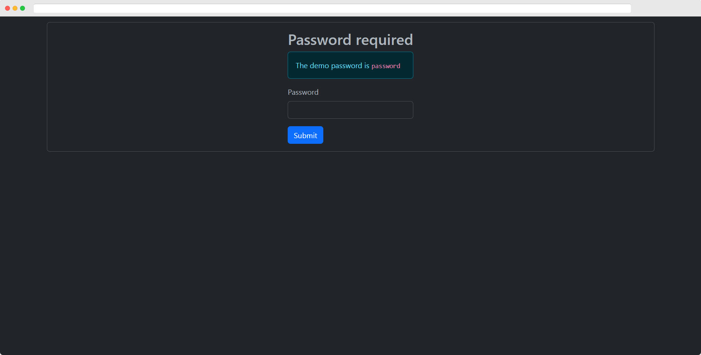
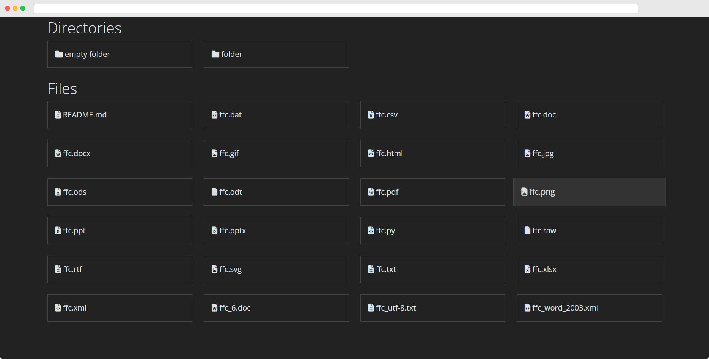

# Yet Another Directory Lister (YADL)

YADL is a simple directory lister that can be used to list the contents of a directory and its subdirectories. It is written in plain PHP and does not require any database to run.

## Table of Contents

- [Yet Another Directory Lister (YADL)](#yet-another-directory-lister-yadl)
  - [Table of Contents](#table-of-contents)
  - [Features](#features)
  - [Installation](#installation)
    - [Note](#note)
  - [Screenshots](#screenshots)
  - [Online Demo](#online-demo)
  - [Customization](#customization)
  - [License](#license)

## Features

- 📂 Lists files and directories
- ⚙️ **Highly** Customizable
- 💻 Easy to use
- 🚫 No database required
- 📱 Responsive
- 🌑 Dark mode
- Many, many more! (Check out the [customization](#customization) section)

## Installation

1. Download the latest `yadl.php` from the [releases page](https://github.com/JMcrafter26/ya-directory-lister/releases).
2. Upload `yadl.php` to the directory you want to list.
3. Open `yadl.php` in your web browser.
4. Customize and enjoy! 🎉

### Note

Please note that YADL is not a full-fledged file manager and is not intended to be used as one. It is only meant to list the contents of a directory and its subdirectories. YADL is not nearly that powerful and secure like other file managers, it was made in two days and is not intended to be used in a production environment. Use it at your own risk.

## Screenshots

> Click to enlarge.

## Online Demo

Demo will be available soon.

## Customization

> This project needs further documentation. Please refer to the source code for more information.

You can customize YADL by editing the `$config` array in `yadl.php`.
The options are quite self-explanatory, but here is a list of them:

- `title`: The title of the page.
- `description`: The description of the page.
- `showFiles`: If enabled, YADL will show files in the list.
- `showDirectories`: Whether to show directories in the list.
- `showHidden`: Whether to show hidden files and directories.
- `showParent`: Display a link to the parent directory.
- `respectPermissions`: If enabled, YADL will respect the file permissions and only show files and directories that the visitor has access to.
- More options are available in the `yadl.php` file.

## License

YADL is licensed under the [MIT License](./LICENSE).
